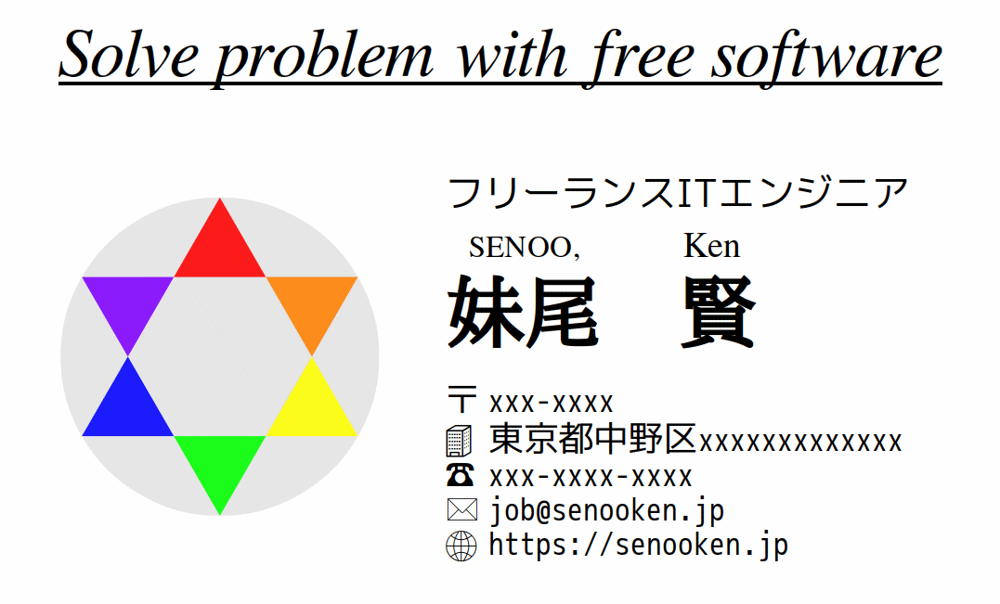
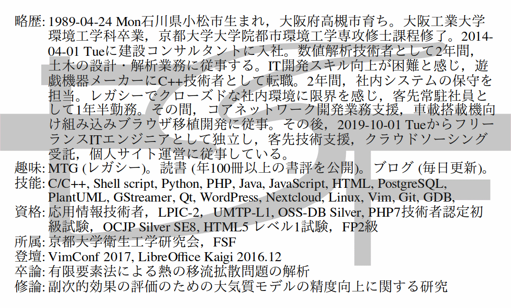

# BusinessCard





## Introduction
個人名刺のサンプルを格納している。

サンプルといっても，住所と電話番号以外は実データであり，簡単なプロフィールの役割を果たしている。

名刺自体 (`card.odg`) はLibreOffce Drawで作成している。

名刺用紙で印刷するためのタイル状配置 (`print.pdf`) には，以下の2種類の方法を試している。

1. pdfjam
2. LibreOffice Writer

具体的な作成方法は「[LibreOfficeによる名刺の作成](https://senooken.jp/blog/2019/09/29/)」に記載している。

pdfjamによるPDFのタイル状配置は以下のコマンドで行っている。

```
pdfjam --nup 2x5 --noautoscale true -o print.front.pdf  $(yes card.front.pdf | head -n 10) 
pdfjam --nup 2x5 --noautoscale true -o print.back.pdf  $(yes card.back.pdf | head -n 10) 
pdfjam -o print.pdf print.front.pdf print.back.pdf
```

## Content
- pdf/: pdfjamによる印刷データの作成結果
- writer/: LibreOffice Writerによる印刷データの作成結果
- card.odg: LibreOffice Drawによる名刺の元データ
- card.pdf: card.odgのPDF出力